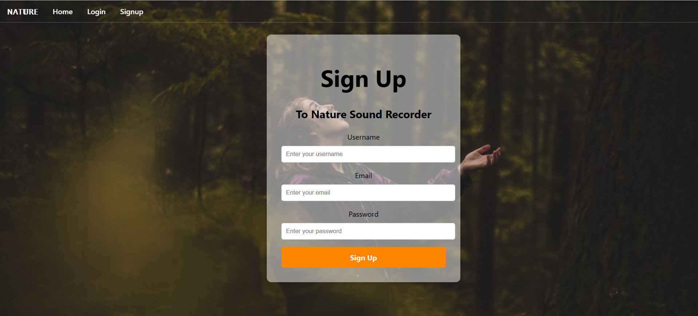
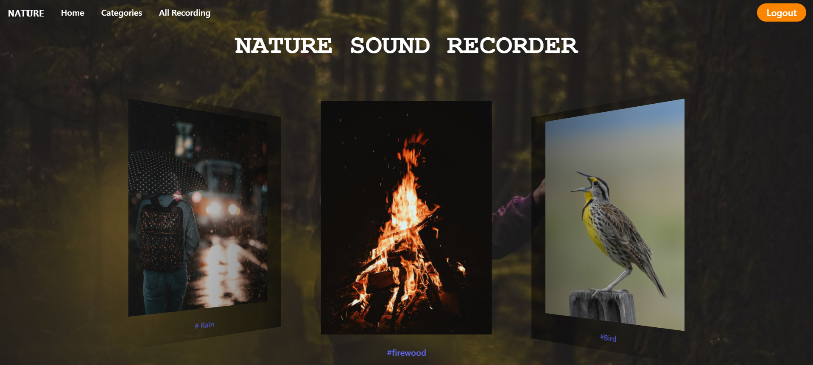
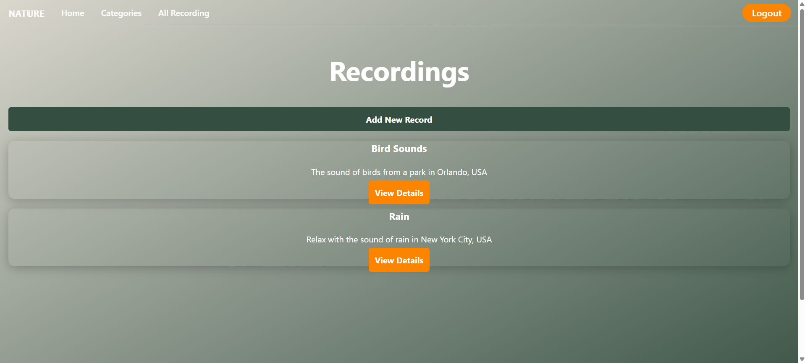
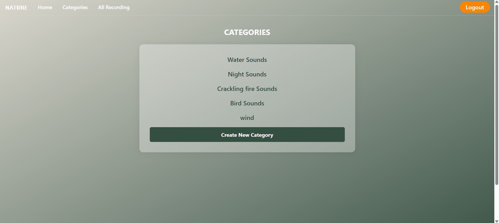

# Nature Sound Recorder - Frontend


This is the **frontend** repository for the Nature Sound Recorder project. The application allows users to record and upload natural sounds, view and manage recordings, and explore contributions by other users.

---

## Project Description

The Nature Sound Recorder frontend provides a user-friendly interface for users to interact with audio recordings of natural environments. It enables users to:

* Sign up and log in
* Upload and edit audio recordings
* View a list of all recordings
* View details of a selected recording
* Filter by category
* Mark favorites

---

## Repository Link

**Backend Repository:** [Nature Sound Recorder - Backend](https://github.com/RaghadAbdullah-maker/nature-sound-recorder-backend.git)

---

## Tech Stack

* **React** (Frontend Framework)
* **Vite** (Development server & build tool)
* **React Router** (Routing)
* **Axios** (API calls)
* **Bulma CSS** (Styling)
* **JWT Authentication** (Token-based auth)
* **Local Storage** (Store user info)

---

## Installation Instructions

### 1. Clone the Repository

```bash
git clone https://github.com/your-username/nature-sound-recorder-frontend.git
cd nature-sound-recorder-frontend
```

### 2. Install Dependencies

```bash
npm install
```
### 3. Set Up Environment Variables

Create a `.env` file


### 4. Run the App

```bash
npm run dev
```

---

## Screenshots







---

## IceBox Features

* Audio playback waveform visualization
* Like/Comment system for each recording
* Dark mode support
* Advanced search and filtering
* User profiles with avatars

---


## How to Use the App

1. Run the backend server (see backend README)
2. Start the frontend with `npm run dev`
3. Sign up for an account
4. Upload a natural sound recording
5. Browse, edit or delete your own recordings
6. Explore recordings from other users

---

## Developed By

**Raghad AlHazmi**
